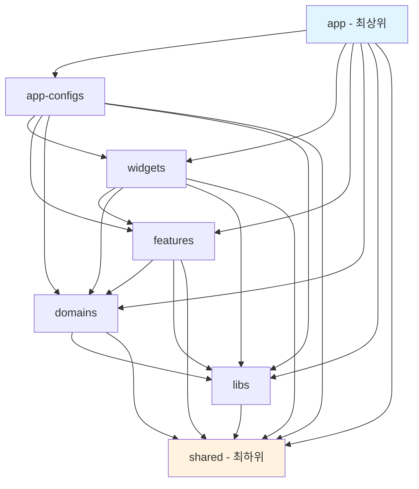
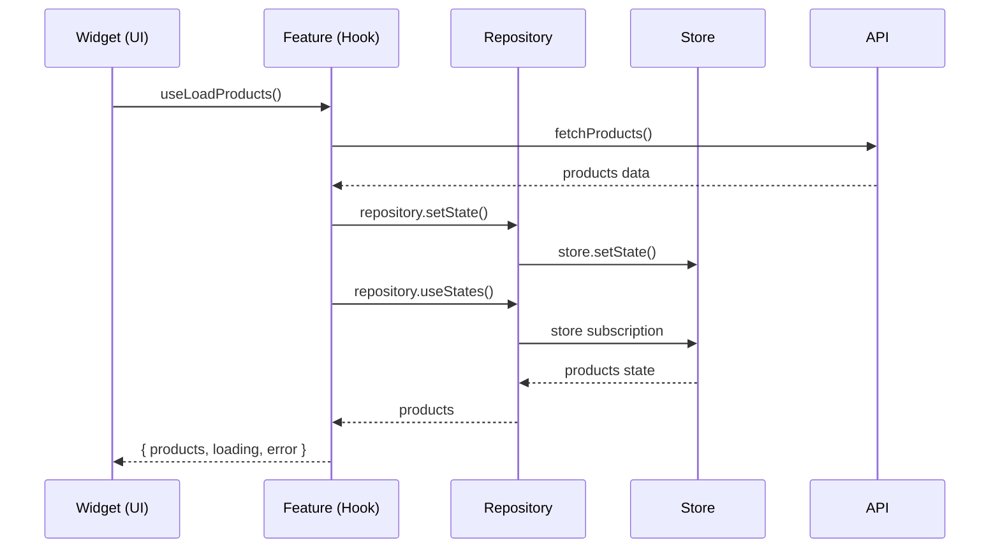
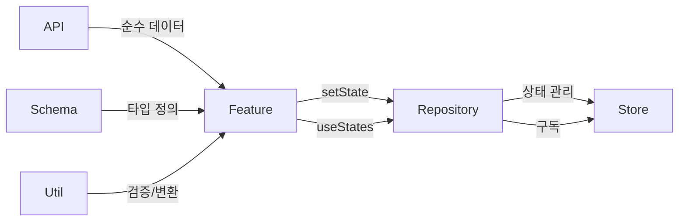

# FSD Next.js Reference

Feature-Sliced Design 아키텍처를 적용한 Next.js 16 레퍼런스 프로젝트입니다.

## 🚀 시작하기

```bash
# 의존성 설치
bun install

# 개발 서버 실행
bun dev
```

http://localhost:3000 에서 확인

## 📁 프로젝트 구조

### 7계층 레이어 아키텍처



### 레이어별 역할

| 레이어 | 역할 | 참조 가능 레이어 |
|--------|------|------------------|
| **app** | Next.js App Router, 페이지 라우팅 | 모든 하위 레이어 |
| **app-configs** | 전역 설정, 미들웨어, 테마 | widgets ~ shared |
| **widgets** | 완성된 UI 컴포넌트 (여러 feature 조합) | features ~ shared |
| **features** | 비즈니스 로직 단위 (hooks) | domains ~ shared |
| **domains** | 엔티티별 데이터 관리 (api, schema, store, util) | libs, shared |
| **libs** | 외부 라이브러리 래퍼 | shared |
| **shared** | 공통 유틸리티, UI 컴포넌트 | - |

## 🔄 호출 관계 다이어그램

### UI → Feature → Domain 흐름



### Domain 내부 구조



## 📂 Domain 구조 예시

```
src/domains/user/
├── api/
│   └── user.api.js          # Mock API (순수 fetch)
├── schema/
│   └── user.schema.js       # 엔티티 정의, 상수
├── store/
│   ├── user.store.js        # Zustand 상태 (순수 상태만)
│   └── user.repository.js   # getState, setState, useStates
└── util/
    └── user.util.js         # 검증, 포맷팅, 유틸리티
```

## 🎯 핵심 규칙

### 1. Repository 패턴
```javascript
// ✅ Repository는 3개 함수만
export const userRepository = {
  getState: () => useUserStore.getState(),
  setState: (state) => useUserStore.setState(state),
  useStates: (selector) => useUserStore(selector),
};
```

### 2. Feature에서만 Repository 호출
```javascript
// ✅ Feature
export const useLoadUsers = () => {
  const users = userRepository.useStates(state => state.users);
  // ... 로직
  userRepository.setState({ users });
  return { users, loading, error };
};

// ✅ Widget
const { users, loading } = useLoadUsers();

// ❌ Widget에서 직접 호출 금지
const users = userRepository.useStates(state => state.users); // NO!
```

### 3. Store는 순수 상태만
```javascript
// ✅ 함수 없이 상태만
export const useUserStore = create(() => ({
  users: [],
  currentUser: null,
}));
```

### 4. Schema는 엔티티 정의만
```javascript
// ✅ Schema - 타입과 상수만
export const USER_ROLES = { ADMIN: 'admin', USER: 'user' };

// ✅ Util - 검증 로직
export const validateUserData = (data) => { /* ... */ };
```

### 5. API는 순수 데이터 반환
```javascript
// ✅ API - store 연결 없음
export const fetchUsers = async () => {
  await delay(500);
  return MOCK_USERS;
};

// ✅ Feature에서 API 호출 후 store 업데이트
const users = await fetchUsers();
userRepository.setState({ users });
```

## 📚 도메인 예시

### User Domain
- 사용자 목록 조회/생성
- 역할 기반 필터링
- 이메일 검증

### Product Domain
- 상품 목록 조회
- 카테고리별 필터
- 장바구니 관리
- 재고 상태 확인

## 📖 상세 문서

- [01. Directory Layer](./docs/01-directory-layer.md) - 레이어 구조 상세
- [02. Global State](./docs/02-global-state.md) - 전역 상태 관리
- [03. JSDoc](./docs/03-jsdoc.md) - 문서화 규칙
- [04. Anonymous Functions](./docs/04-anonymous-functions.md) - 익명 함수 사용
- [05. Export Default](./docs/05-export-default.md) - Export 규칙
- [06. Function Naming](./docs/06-function-naming.md) - 함수 네이밍
- [07. Component Declaration](./docs/07-component-declaration.md) - 컴포넌트 선언
- [08. Component Ordering](./docs/08-component-ordering.md) - 컴포넌트 순서

## 🛠 기술 스택

- **Framework**: Next.js 16.1.6 (App Router)
- **Runtime**: Bun
- **UI**: Material-UI, Emotion
- **State**: Zustand
- **Language**: JavaScript (JSDoc)

## 📝 License

MIT
