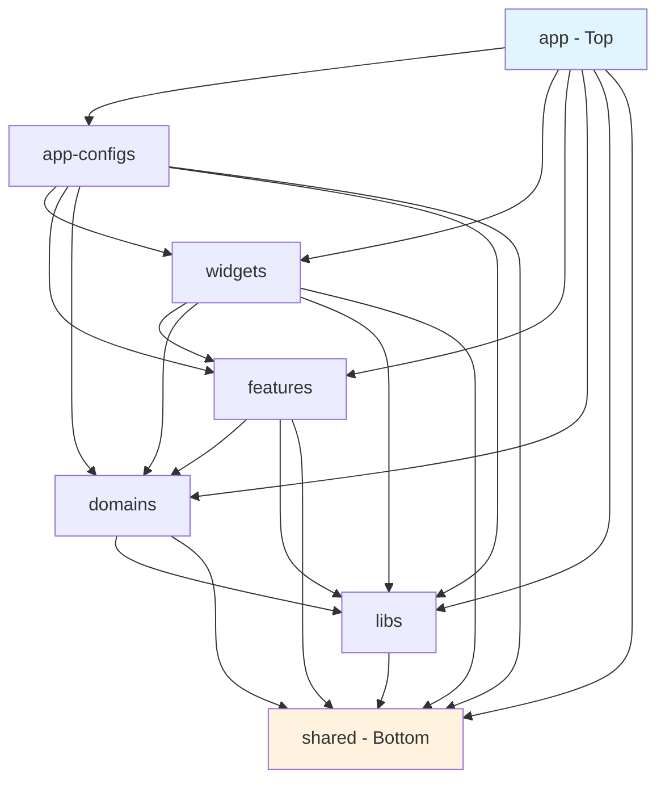
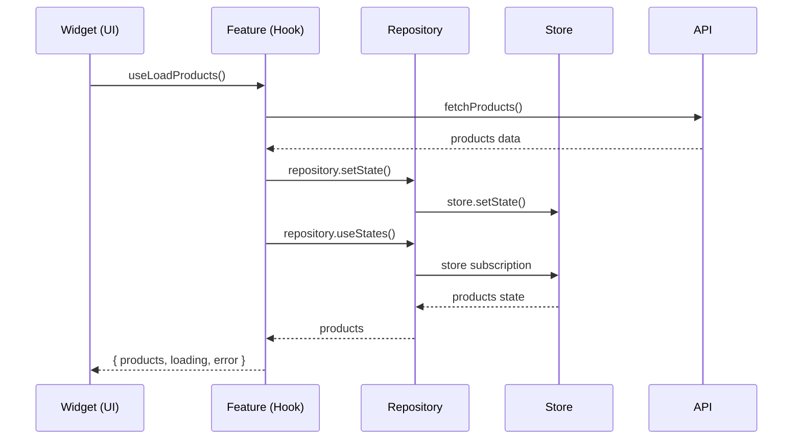
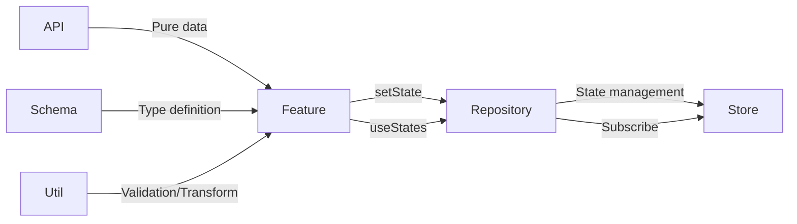

# FSD Next.js Reference

A Next.js 16 reference project implementing Feature-Sliced Design architecture.

## 🚀 Getting Started

```bash
# Install dependencies
bun install

# Run development server
bun dev
```

Open http://localhost:3000

## 📁 Project Structure

### 7-Layer Architecture



### Layer Responsibilities

| Layer | Role | Can Reference |
|-------|------|---------------|
| **app** | Next.js App Router, page routing | All lower layers |
| **app-configs** | Global config, middleware, theme | widgets ~ shared |
| **widgets** | Complete UI components (multiple features) | features ~ shared |
| **features** | Business logic units (hooks) | domains ~ shared |
| **domains** | Entity data management (api, schema, store, util) | libs, shared |
| **libs** | External library wrappers | shared |
| **shared** | Common utilities, UI components | - |

## 🔄 Call Flow Diagram

### UI → Feature → Domain Flow



### Domain Internal Structure



## 📂 Domain Structure Example

```
src/domains/user/
├── api/
│   └── user.api.js          # Mock API (pure fetch)
├── schema/
│   └── user.schema.js       # Entity definition, constants
├── store/
│   ├── user.store.js        # Zustand state (pure state only)
│   └── user.repository.js   # getState, setState, useStates
└── util/
    └── user.util.js         # Validation, formatting, utilities
```

## 🎯 Core Rules

### 1. Repository Pattern
```javascript
// ✅ Repository has only 3 functions
export const userRepository = {
  getState: () => useUserStore.getState(),
  setState: (state) => useUserStore.setState(state),
  useStates: (selector) => useUserStore(selector),
};
```

### 2. Only Features Call Repository
```javascript
// ✅ Feature
export const useLoadUsers = () => {
  const users = userRepository.useStates(state => state.users);
  // ... logic
  userRepository.setState({ users });
  return { users, loading, error };
};

// ✅ Widget
const { users, loading } = useLoadUsers();

// ❌ Direct call from Widget is prohibited
const users = userRepository.useStates(state => state.users); // NO!
```

### 3. Store Contains Pure State Only
```javascript
// ✅ State only, no functions
export const useUserStore = create(() => ({
  users: [],
  currentUser: null,
}));
```

### 4. Schema for Entity Definition Only
```javascript
// ✅ Schema - types and constants only
export const USER_ROLES = { ADMIN: 'admin', USER: 'user' };

// ✅ Util - validation logic
export const validateUserData = (data) => { /* ... */ };
```

### 5. API Returns Pure Data
```javascript
// ✅ API - no store connection
export const fetchUsers = async () => {
  await delay(500);
  return MOCK_USERS;
};

// ✅ Feature calls API then updates store
const users = await fetchUsers();
userRepository.setState({ users });
```

## 📚 Domain Examples

### User Domain
- User list retrieval/creation
- Role-based filtering
- Email validation

### Product Domain
- Product list retrieval
- Category filtering
- Shopping cart management
- Stock status checking

## 📖 Detailed Documentation

### English
- [01. Directory Layer](./docs/en/01-directory-layer.md) - Layer structure details
- [02. Global State](./docs/en/02-global-state.md) - Global state management
- [03. JSDoc](./docs/en/03-jsdoc.md) - Documentation rules
- [04. Anonymous Functions](./docs/en/04-anonymous-functions.md) - Anonymous function usage
- [05. Export Default](./docs/en/05-export-default.md) - Export rules
- [06. Function Naming](./docs/en/06-function-naming.md) - Function naming
- [07. Component Declaration](./docs/en/07-component-declaration.md) - Component declaration
- [08. Component Ordering](./docs/en/08-component-ordering.md) - Component ordering

### 한국어
- [01. Directory Layer](./docs/kr/01-directory-layer.md) - 레이어 구조 상세
- [02. Global State](./docs/kr/02-global-state.md) - 전역 상태 관리
- [03. JSDoc](./docs/kr/03-jsdoc.md) - 문서화 규칙
- [04. Anonymous Functions](./docs/kr/04-anonymous-functions.md) - 익명 함수 사용
- [05. Export Default](./docs/kr/05-export-default.md) - Export 규칙
- [06. Function Naming](./docs/kr/06-function-naming.md) - 함수 네이밍
- [07. Component Declaration](./docs/kr/07-component-declaration.md) - 컴포넌트 선언
- [08. Component Ordering](./docs/kr/08-component-ordering.md) - 컴포넌트 순서

## 🛠 Tech Stack

- **Framework**: Next.js 16.1.6 (App Router)
- **Runtime**: Bun
- **UI**: Material-UI, Emotion
- **State**: Zustand
- **Language**: JavaScript (JSDoc)

## 📝 License

MIT
